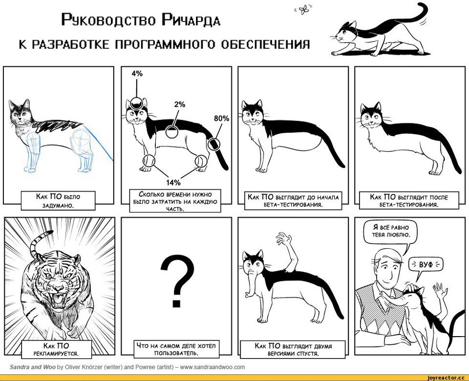

# Get3DModel
## [Руководство по использованию багтрекера](./docs/Update/Kulikov/bugtracker.md)
## [Релизы](https://github.com/unngrouponce/unn_grouponce/releases)
## [Команда](https://github.com/unngrouponce/unn_grouponce/wiki/Команда)
## Структура репозитория

Репозиторий содержит следующие директории и файлы:

 - `completed documents` - завершенные документы, внешняя документация.
  - `docs` - директория, содержащая документацию.
 
	- `docs\Update` - данная папка хранит текущие изменения для докумениации.
	- `docs\Update\"имя пользователя"` - данная папка хранит работу над документацией(текущей) каждого пользователя.
	- `docs\Docs and files from customer` - данная папка хранит файлы и документы полученые от заказчика.
  - `samples` - примеры тестовых данных. 
  - `src` - исходный код проекта.
  - `test` -файлы для тестирования, эталоны для тривиальных примеров.
  - `README.md` - данный файл. Общая документация
  - `.gitignore`- перечень директорий/файлов, которые игнорируются системой контроля версий.

### Список веток:

- `master` - Данная ветка содержит актуальную рабочую копию проекта.

- `Get3DModel` - Данная ветка содержит рабочие версии исходного кода.

По окончании тестирования, и исправления багов, производим следующее:

- переключаемся на ветку `master`
- получить в ветку master все правки из ветки `Get3DModel`
- протестировать (если это представляется возможным)

### Процесс работы:

когда набор новых фич готов (и хотябы минимально оттестирован каждым программистом своего функционала),
и менеджер дал добро на выкат нового функционала, то происходит слияние фичи в ветку master 
(программист смотрит как его функционал работает с другими модулями), если все хорошо, 
то сливаем фичи из ветки `Get3DModel` в ветку `master`. с этого момента не желательно появление новых фич в текушем релизе.
код который находится в ветке `Get3DModel` подвергается тестированию, исправлению багов 

