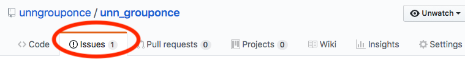
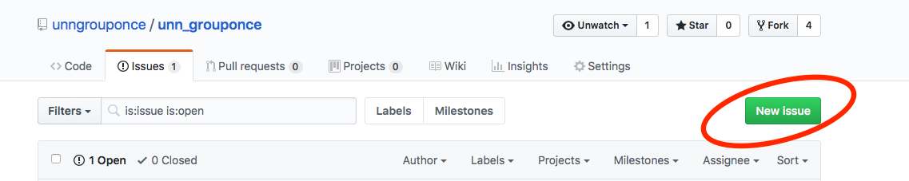
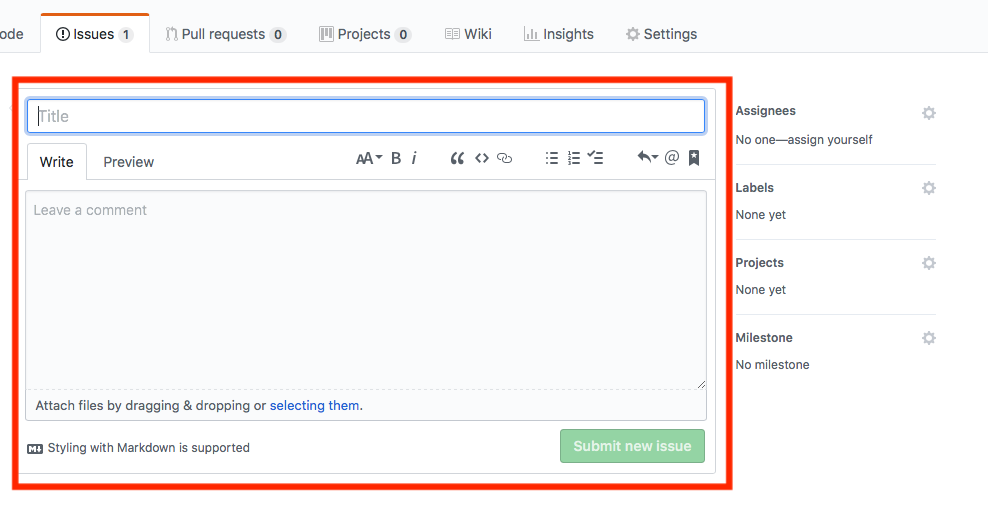
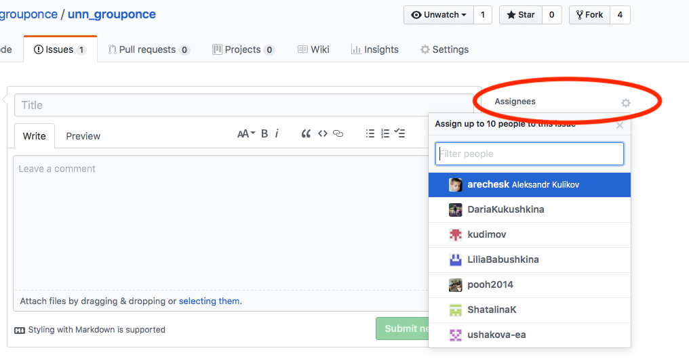
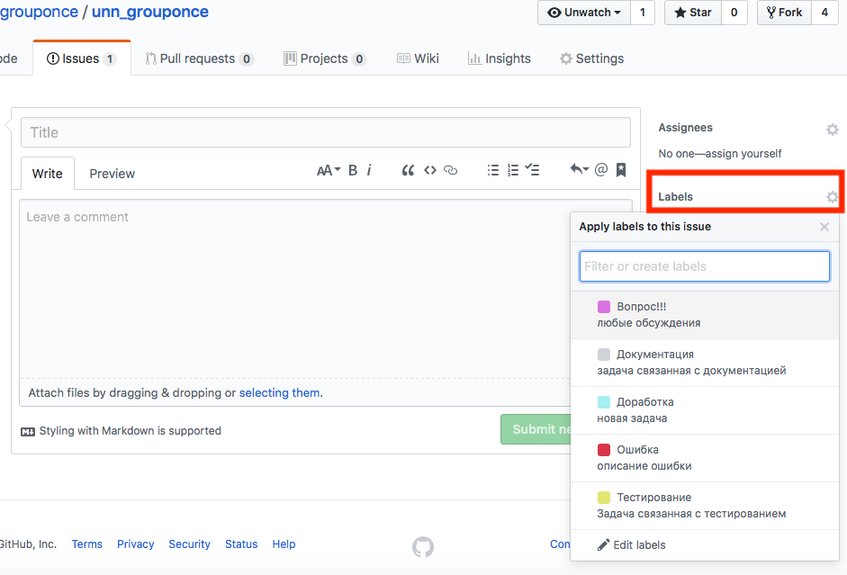
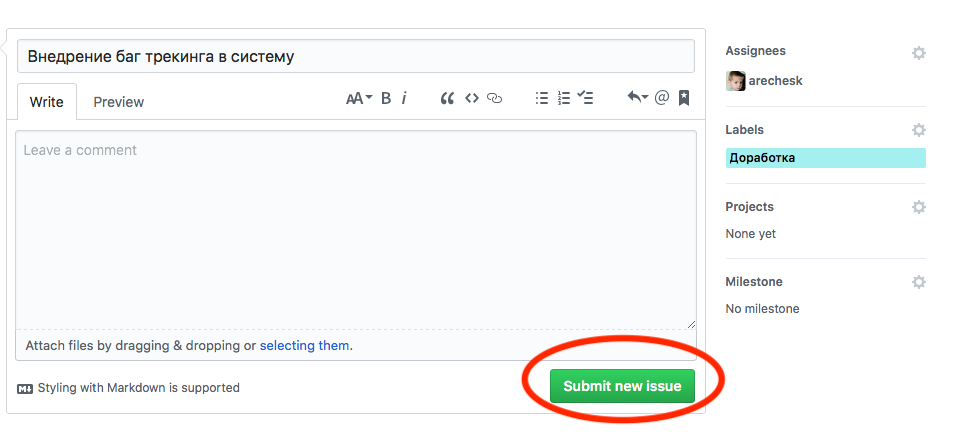
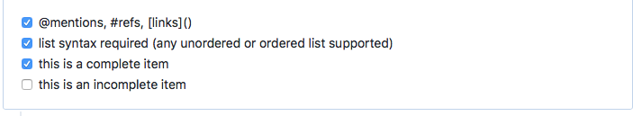

# Руководство по использованию багтрекера
> Багтрекер находится по адресу: [https://github.com/unngrouponce/unn\_grouponce/issues](https://github.com/unngrouponce/unn\_grouponce/issues)

Багтрекер(список задач) необходим для того что бы учитывать и контролировать ошибки и неполадки, найденные в программе, пожелания пользователей, а также следить за процессом устранения этих ошибок и выполнения или невыполнения пожеланий и обсуждения текущих задач.
## Создание задачи
1. Для создания новой задачи перейди на вкладку `Issues`.
	
2. Нажми на кнопку `New issue`.
	
3. Опиши задачу.
	
4. В меню `Assignees` назнач задачу одному или нескольким участникам команды.
	
5. В меню `Labels` определи категорию задачи.
	
6. Сохрани задачу нажав на кнопку `Submit new issue`.
	

## Категории задач
- `Ошибка`-запись должна содержать как описание ошибки так и способ её воспроизведения
- `Документация`- задачи связанные с документацией 
- `Тестирование` -задачи связанные с тестированием
- `Доработка` - описание новых функций проекта которые необходимо реализовать
- `Вопрос!!!` - обсуждение любых вопросов которые не входят в предыдущие категории

## Ссылки
-  **ссылка на участника** - Эта функция по механике похожа на упоминания в твиттере. При создании комментария введите символ «@» и сразу же после него никнейм пользователя. У упомянутого пользователя на странице оповещений появится соответствующая ссылка на тикет или пулл-реквест, в котором его упомянули.
- **привязка комита к задаче** - Если текст коммита, содержит fix и номер задачи после символа «#», тогда задача с соответствующим номером будет закрыта.

	То есть коммит с таким сообщением:
	>$ git commit -m "sometext, fix #12". 

	будет привязан к задаче под номером 12.

## Список задач
Синтаксис у списка задач такой:
```
- [x] @mentions, #refs, \[links]()
- [x] list syntax required (any unordered or ordered list supported)
- [x] this is a complete item
- [ ] this is an incomplete item
```


При сохранении комментария со списком он превращается в полноценный список задач с чекбоксами, которые можно отмечать (при этом соответствующий [x] появляется в markdown-разметке автоматически). 

