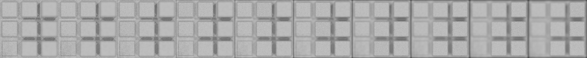
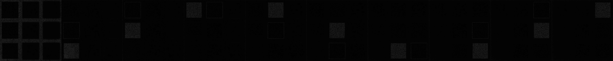
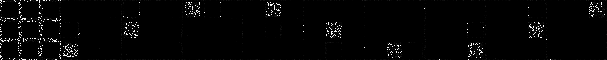
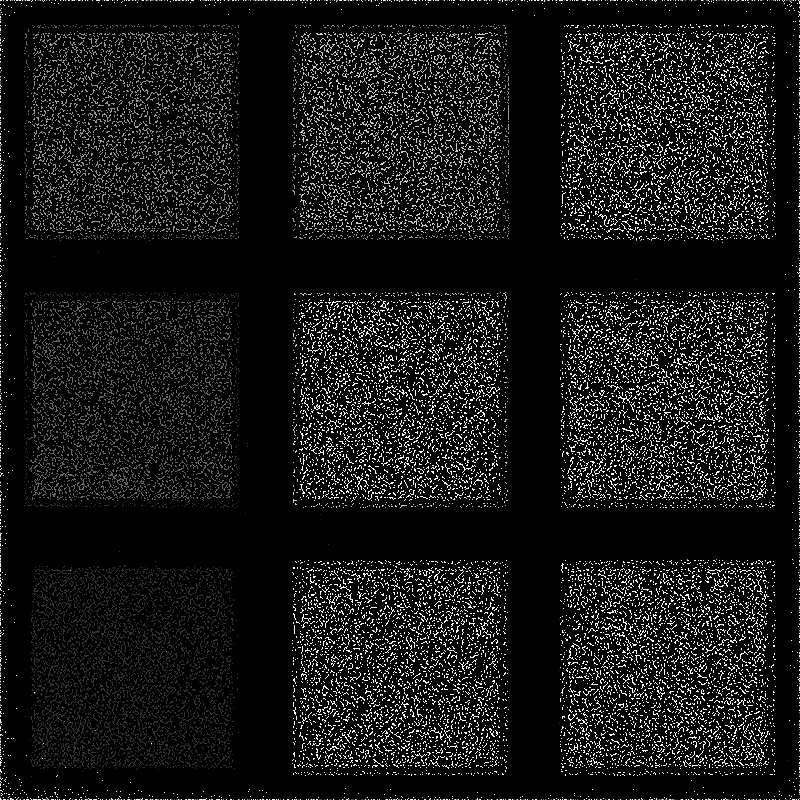

# Алгоритмы для вычисления степени размытости пикселя и его высоты
## 1. Определение размытости пикселя
Для определения размытости пикселя применяют фильтр Лапласа.
Фильтр Лапласа это свертка с коэффициентами
[[0,1,0],[1,-4,1],[0,1,0]].

>Подробнее о фильтре лапласа:

>- [фильтр Лапласа вики](https://ru.wikipedia.org/wiki/Дискретный_оператор_Лапласа)
>- [Интуит](https://www.intuit.ru/studies/courses/993/163/lecture/4507?page=3)

### Алгоритм
1. Берём исходные изображения в градациях серого 
	

2. Применяем фильтр Лапласа
	
3. Применяем пороговую бинаризацию
	
	те точки, которые белые находятся в фокусе.

##  2. Карта глубины
### Алгоритм
1. Берем исходные изображения в градациях серого
	
2. Применяем фильтр Лапласа
	
3. Применяем пороговую бинаризацию, так чтобы пиксели находящиеся в фокусе были равны 1, иначе 0
	
4. умножаем каждый пиксель каждого изображения на i*256/n, 
где i-номер изображения, n - кол-во изображений. И суммируем матрицы изображений:
	
	чем светлее пиксель, тем выше находится точка.
